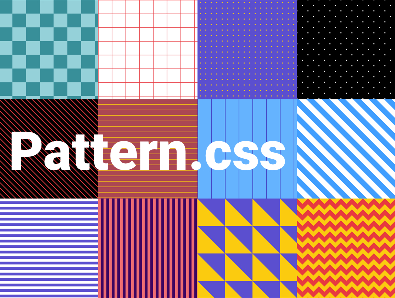

# pattern.css

CSS only library to fill your empty background with beautiful patterns.

See the full [documentation](https://bansal.io/pattern-css)



## Features

- Only CSS. No JavaScript!
- < 1KB minified and gzipped!
- Supports all modern browsers
- Built Using SCSS.
- Full color control.

## Installation

### via npm

```bash
npm install pattern.css
```

### via cdn

```html
<link href="https://unpkg.com/pattern.css" rel="stylesheet">
```

### download

```html
<link href="dist/pattern.min.css" rel="stylesheet">
```

## Usage

pattern.css can be used with any css framework.

### With shorthand framework

```html
<div class="pattern-checks-sm bg-blue white">...</div>
```

### With bootstrap framework

```html
<div class="pattern-checks-sm bg-primary text-white">...</div>
```

## Pattern Classes

|small|medium|large|extra large|
|--- |--- |--- |--- |
|pattern-checks-sm|pattern-checks-md|pattern-checks-lg|pattern-checks-xl|
|pattern-grid-sm|pattern-grid-md|pattern-grid-lg|pattern-grid-xl|
|pattern-dots-sm|pattern-dots-md|pattern-dots-lg|pattern-dots-xl|
|pattern-cross-dots-sm|pattern-cross-dots-md|pattern-cross-dots-lg|pattern-cross-dots-xl|
|pattern-diagonal-lines-sm|pattern-diagonal-lines-md|pattern-diagonal-lines-lg|pattern-diagonal-lines-xl|
|pattern-horizontal-lines-sm|pattern-horizontal-lines-md|pattern-horizontal-lines-lg|pattern-horizontal-lines-xl|
|pattern-vertical-lines-sm|pattern-vertical-lines-md|pattern-vertical-lines-lg|pattern-vertical-lines-xl|
|pattern-diagonal-stripes-sm|pattern-diagonal-stripes-md|pattern-diagonal-stripes-lg|pattern-diagonal-stripes-xl|
|pattern-horizontal-stripes-sm|pattern-horizontal-stripes-md|pattern-horizontal-stripes-lg|pattern-horizontal-stripes-xl|
|pattern-vertical-stripes-sm|pattern-vertical-stripes-md|pattern-vertical-stripes-lg|pattern-vertical-stripes-xl|
|pattern-triangles-sm|pattern-triangles-md|pattern-triangles-lg|pattern-triangles-xl|
|pattern-zigzag-sm|pattern-zigzag-md|pattern-zigzag-lg|pattern-zigzag-xl|


## Contributors

### Code Contributors

This project exists thanks to all the people who contribute. [[Contribute](CONTRIBUTING.md)].

<a href="https://github.com/bansal-io/pattern.css/graphs/contributors"></a>

### Financial Contributors

Become a financial contributor and help us sustain our community. [[Contribute](https://opencollective.com/patterncss/contribute)]

#### Individuals

<a href="https://opencollective.com/XX"></a>

#### Organizations

Support this project with your organization. Your logo will show up here with a link to your website. [[Contribute](https://opencollective.com/patterncss/contribute)]

<a href="https://opencollective.com/patterncss/organization/0/website"></a>


## License

MIT
